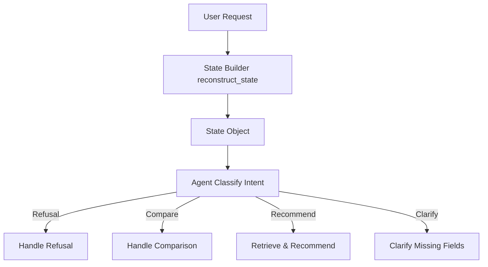

# Design Decisions

This document details the high-level architecture, design decisions, and guardrail strategy behind the SkillMatch AI Recommender.

---

## Architectural Approach

We opted for a **State-Driven Orchestration Architecture** that prioritizes determinism, predictability, and low API latency over complex, multi-agent frameworks.

### 1. Deterministic State Reconstruction (Hybrid Logic)
Instead of relying on the LLM to summarize conversation state or remember what fields have been collected across turns (which introduces hallucinations and increases latency), we designed a deterministic parser (`reconstruct_state`).
* It inspects the entire list of user and assistant messages.
* It uses regular expressions and pattern-matching to extract:
  * Job/Role Title (e.g., "senior python engineer")
  * Seniority Level (e.g., Senior, Junior, Graduate, Lead)
  * Experience (years)
  * Assessment Types (e.g., Cognitive vs. Personality vs. Technical Coding)
* This state object is passed directly to the Agent.

### 2. Logic-Based vs. LLM-Based Routing
To minimize API calls, we use a single LLM request per active turn. The agent first evaluates the reconstructed state:
* If the user message is classified as off-topic or malicious, it executes `handle_refusal()`.
* If the user is specifically comparing two assessments, it executes `handle_comparison()`.
* If we have collected the minimum necessary information, we load catalog context and call `generate_content()` with a structured output schema (`LLMOutputSchema`) to make recommendations.
* If critical fields are missing, we use `prioritize_question()` to deterministically select the next question to ask the user.

---

## Safety, Refusals, & Guardrails

We enforced a strict triple-layer guardrail policy to protect system integrity:

1. **Prompt Injection & Off-Topic Filters**:
   A dedicated classification prompt checks the user's input for common injection prompts (e.g. "Ignore previous instructions") or off-topic requests (e.g. coding help, trivia, general hiring advice). If classified as `REFUSE`, the system outputs a friendly, professional explanation stating it can only help with SHL assessment recommendations.

2. **Vague Turn-1 Query Handling**:
   If a user begins with an extremely broad query like *"I need an assessment"*, the agent refuses to guess products. It prompts the user to provide the role title, seniority, and what skills they want to evaluate.

3. **Hallucination Recovery Filters**:
   If the LLM recommends assessment names that do not exist or mismatch the retrieved catalog, the backend's `match_and_populate()` filter discards them. If this results in `0` valid recommendations, the agent automatically intercepts the response and falls back to a clarification turn instead of presenting empty or hallucinated results.

---

## AI Tools & Assistant Usage

This project was built in collaboration with **Antigravity**, a coding assistant:
* **Boilerplate & API Setup**: Leveraged for building out the Fastapi routing layer and configuring the Gemini Python SDK.
* **Regex Engine Design**: Assisted in creating robust, edge-case-proof regular expressions for the `state_builder.py` heuristic parser.
* **Trace Parsing**: Used to quickly convert raw sample trace markdown files into structured evaluation loops.
